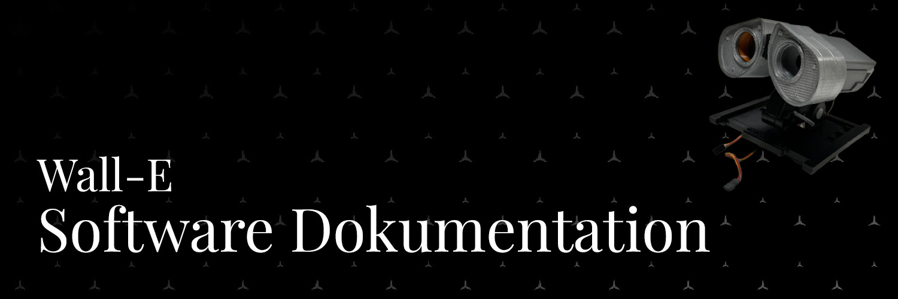
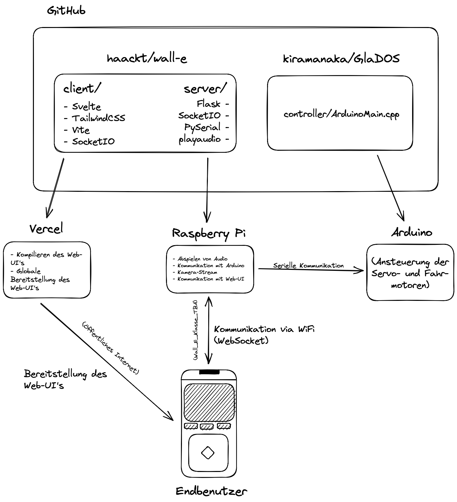

```
⚠️ Hinweis
===========

Die gewählte Umsetzung der Software ist nicht die einzig 
mögliche Lösung und nicht einsteigerfreundlich. Ist es möglich, 
diverse Komponenten zu vereinfachen und damit das gesamte 
Projekt einsteigerfreundlicher zu gestalten.
```

## Anforderung des Projektes

1. Ansteuerung des Roboters über ein GUI
2. Live-Video-Übertragung
3. Sprachfunktionen (Sprachausgabe)

## Struktur

Die Software besteht aus mehreren Komponenten, die in der folgenden Grafik dargestellt sind.



Im Folgenden werden die einzelnen Komponenten kurz vorgestellt.

## Web-UI

### Anforderungen

1. Ansteuerung des Roboters über ein GUI
2. Sprachfunktionen (Sprachausgabe)
3. Echtzeit Video-Übertragung
4. Echtzeit Kommunikation mit dem Roboter

### Technologien

1. [Vite](https://vitejs.dev/)
   1. Laufzeitumgebung für die Entwicklung des Web-UIs
   2. Performance-Optimierung
   3. Packaging der Anwendung für die Produktion
2. [Svelte](https://svelte.dev/)
   1. Framework für die Entwicklung der Web-UI
   2. Modularität
   3. Reaktivität des UIs (z.B. bei Änderungen der Daten)
3. [SocketIO](https://socket.io/)
   1. Einfache Kommunikation zwischen Web-UI und Roboter
   2. Superset der normalen Websocket-Kommunikation
4. [TailwindCSS](https://tailwindcss.com/)
   1. Einfache und schnelle Erstellung von Stilen für das UI
5. [TypeScript](https://www.typescriptlang.org/)
   1. Typsichere Entwicklung
   2. Einfache Wartbarkeit
   3. Einfache Erweiterbarkeit

#### Warum die Wahl der Technologien?

Meine Entscheidung ist auf die o. g. gefallen, da sie ein modernes Grundgerüst für eine Web-UI bieten. Die Technologien sind einfach zu erlernen und bieten eine gute Performance.

Es wäre möglich gewesen, das Web-UI ohne Framework zu erstellen (z.B. mit VanillaJS). Jedoch ist die Skalierbarkeit und Wartbarkeit mit einem Framework deutlich höher.

Die Wahl der Technologien ist somit auf die persönlichen Preferenzen sowie Erfahrungen zurückzuführen.

### Umsetzung

#### `vite.config.ts`, `postcss.config.cjs`, `tailwind.config.cjs`, `tsconfig.json`, `tsconfig.node.json`, `svelte.config.js`, `package.json`, `package-lock.json`, `.gitignore`, `.vscode/`

Die o. g. Dateien sind Konfigurationsdateien für die Entwicklungsumgebung sowie die Build-Pipeline. Sie sind nicht der Teil der Anwendung und werden nur für die Entwicklung benötigt.

#### `public/`

Im Ordner `public/` befinden sich alle Dateien, die nicht von der Build-Pipeline verarbeitet werden. Dies sind z.B. Bilder, die im UI verwendet werden.

#### `index.html`

Die Datei `index.html` ist die Einstiegspunkt für die Web-UI. Sie wird von der Build-Pipeline verarbeitet und enthält die Basis-Struktur des UIs.

Vite verarbeitet die Datei und fügt die benötigten Skripte und Stylesheets ein.

#### `src/`

##### `src/vite-env.d.ts`

Die Datei `src/vite-env.d.ts` ist eine TypeScript-Definition für die Umgebungsvariablen, welche von Vite zur Laufzeit zur Verfügung gestellt werden.

##### `src/main.ts`

Die Datei `src/main.ts` ist der Einstiegsskript, welcher in der Datei `index.html` eingebunden wird. Sie ist die zentrale Datei, welche die Anwendung startet.

##### `src/App.svelte`

Die Datei `src/App.svelte` ist die zentrale Komponente der Web-UI. Sie enthält die Struktur des UIs und die Logik für die Kommunikation mit dem Roboter.

##### `src/assets/`

Im Ordner `src/assets/` befinden sich alle Dateien, welche von der Build-Pipeline verarbeitet werden. Dies sind z.B. Bilder, die im UI verwendet werden.

##### `src/lib/components/`, `src/lib/layout/`

Im Ordner `src/lib/components/` (und `src/lib/layout/`) befinden sich die einzelnen Komponenten, welche in der Datei `src/App.svelte` verwendet werden.

###### `src/lib/components/toast.ts`

Die Datei `src/lib/components/toast.ts` ist eine Toast-Komponente, welche eine Nachricht anzeigt. Sie wird verwendet, um dem Benutzer eine Rückmeldung zu geben.

##### `src/stores/`

Im Ordner `src/stores/` befinden sich die einzelnen Stores, welche in der Datei `src/App.svelte` verwendet werden.

Stores sind eine Möglichkeit, um Daten zwischen Komponenten zu teilen. Sie sind ähnlich zu den globalen Variablen, jedoch werden sie in einer zentralen Datei verwaltet.

## Server

### Anforderungen

1. Abspielen von Sprachausgaben
2. Serielle Kommunikation mit dem Roboter
3. Bereitstellung eines Video-Streams

### Technologien

1. Flask, Flask_SocketIO
   1. Einfache Entwicklung eines Web-Socket-Servers
2. PySerial
   1. Einfache Kommunikation mit dem Roboter via serieller Schnittstelle
3. playsound
   1. Abspielen von Audio-Dateien

#### Warum die Wahl der Technologien?

Die Wahl der Technologien ist auf die persönlichen Preferenzen sowie Erfahrungen zurückzuführen. Sie können durch andere Technologien ersetzt werden.

### Umsetzung

#### `app.py`

Die Datei `app.py` ist die zentrale Datei, welche die Anwendung startet. Sie enthält die Logik für die Kommunikation mit dem Roboter und dem Web-UI.

##### `commands.py`

Die Datei `commands.py` enthält die Logik für die serielle Kommunikation mit dem Roboter, und stellt die Befehle der zentralen Datei bereit.

##### `speaker.py`

Die Datei `speaker.py` enthält die Logik für das Abspielen von Sprachausgaben, und stellt die Funktionen der zentralen Datei bereit.

#### `camera.py`

Die Datei `camera.py` enthält die Logik für die Bereitstellung eines Video-Streams.
Sie muss separat gestartet werden, da sie nicht in der zentralen Datei verwendet wird.